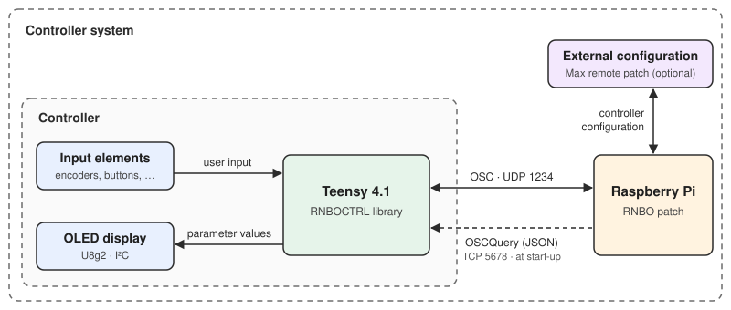
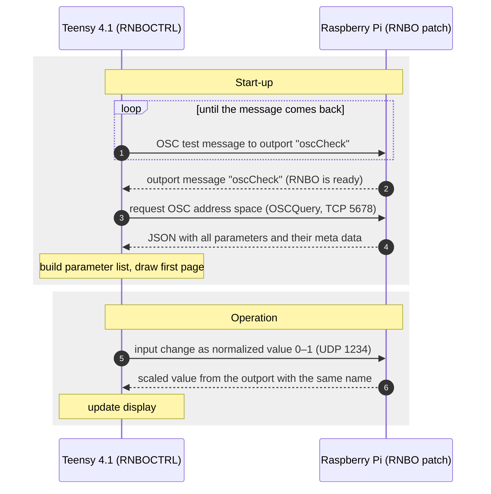
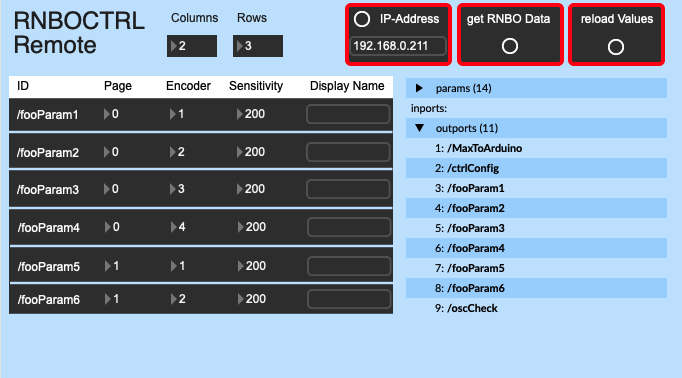

<h1 align="center">RNBOCTRL</h1>

<p align="center">
  <b>A configurable display controller for <a href="https://rnbo.cycling74.com/">RNBO</a> projects on the Raspberry Pi</b><br>
  Arduino library for the Teensy 4.1
</p>

<p align="center">
  <a href="#how-it-works">How it works</a> ·
  <a href="#installation">Installation</a> ·
  <a href="#usage">Usage</a> ·
  <a href="#setting-up-the-rnbo-patch">RNBO patch rules</a> ·
  <a href="#remote-configuration-with-max">Remote configuration</a> ·
  <a href="#known-limitations">Limitations</a>
</p>

<p align="center">
  
</p>

RNBOCTRL is an Arduino library for the **Teensy 4.1** (with Ethernet kit). It lets you control any RNBO patch running on a Raspberry Pi with any input elements (e.g. encoders, buttons) connected to the Teensy. An OLED display gives instant feedback about value changes and shows all adjustable parameters.

The Teensy connects to the Raspberry Pi via OSC (UDP/TCP), reads the parameter configuration of the patch automatically, shows the (scaled) parameter values on the display and sends your inputs to RNBO. You only write the code that reads your own input hardware; parameter management, OSC communication and drawing the screen are handled by the library.

Once the controller is built, it adapts to the configuration of your RNBO patch. Any RNBO patch that follows the [rules below](#setting-up-the-rnbo-patch) can be controlled without any additional coding.

> [!NOTE]
> **Status:** early, working prototype. It has only been tested with the prototype hardware described below. Expect rough edges. Issues and pull requests are welcome.

Developed as part of a master's thesis at Hochschule der Medien Stuttgart.

## Features

- Parameters, pages, input element assignment and display config are read from the RNBO patch itself (via OSCQuery/JSON) instead of being hard-coded in the Teensy sketch
- Grid layout: input element *n* on the controller corresponds to parameter slot *n* on the screen
- Several screen pages, so one encoder can control different parameters on different pages
- Display shows the values *after* scaling in RNBO (sent back through RNBO outports)
- Configuration can be changed at runtime with a Max patch (`RNBOCTRLRemote.maxpat`) without re-flashing the Teensy
- Input-agnostic: the library only needs the input index and the change of value. It is fully independent of the type of input element.

## How it works

The Teensy and the Raspberry Pi are connected by Ethernet (static IPs). Messages travel as OSC over UDP port **1234**; the parameter configuration is fetched once at start-up from the RNBO OSCQuery server on TCP port **5678**.



## Hardware used in the prototype

| Part | Used in the prototype |
|---|---|
| Microcontroller | Teensy 4.1 with Ethernet kit, connected to the Raspberry Pi by Ethernet cable |
| Single-board computer | Raspberry Pi 4 Model B running the RNBO Raspberry Pi image (RNBO also supports Pi 3, 5 and Zero 2 W) |
| Display | 128×64 I²C OLED (SH1106 driver, via U8g2) |
| Input elements | 7 rotary encoders with push button (KY-040): 6 in a 2×3 grid + 1 for page navigation |
| Audio (optional) | HiFiBerry DAC+ ADC |

Other displays supported by U8g2 and other input hardware should work: the display is passed to the library as a U8g2 object, and input is reported through `updateParamValue(index, change)`.

## Installation

1. Install the Teensy board support (Teensyduino) for the Arduino IDE.
2. Install these libraries via the Library Manager: **QNEthernet**, **ArduinoJson**, **OSC** (CNMAT), **U8g2**. `Wire` is part of the board package.
3. Copy this repository's folder into your Arduino `libraries` folder (folder name `RNBOCTRL`) and restart the IDE.
4. Open an example from *File → Examples → RNBOCTRL*.

## Usage

```cpp
#include <RNBOCTRL.h>

IPAddress controllerIP(192, 168, 8, 100); // Teensy
IPAddress rnboIP(192, 168, 8, 211);       // Raspberry Pi
IPAddress gateway(192, 168, 8, 1);
IPAddress subnet(255, 255, 255, 0);

RNBOCTRL controller;
RNBODisplay display;
U8G2_SH1106_128X64_NONAME_F_HW_I2C u8g2(U8G2_R0, U8X8_PIN_NONE);

void setup() {
  display.begin1(&u8g2);
  controller.begin(controllerIP, rnboIP, gateway, subnet, &display);
  display.begin2(&controller);
  // ... set up your input pins
}

void loop() {
  // read your inputs, then report them:
  // controller.updateParamValue(inputIndex, +1 or -1);
  controller.controllerLoop();
}
```

See `examples/testcode_encoder` for a complete sketch with 7 encoders and 6 buttons. `examples/testcode_FMSynth` additionally shows how to pass a custom draw function to `controllerLoop()`.

Input indices: index `0` is the page-navigation encoder (the `scroll` parameter). Buttons in the examples use `i + NUM_ENCODERS`.

## Setting up the RNBO patch

For RNBOCTRL to find and control your parameters, the RNBO patch has to follow a few rules.

**1. Parameters on the top level.** All controllable parameters must be on the top patcher level. Parameters inside subpatchers are not detected.

**2. Meta data for every parameter.** Each parameter carries its controller configuration in its `@meta` attribute:

<p align="center">
  
</p>

```
param foo @meta page:0, index:1, sensitivity:200, displayName:'foo'
```

| Meta key | Meaning |
|---|---|
| `page` | Screen page on which the parameter is shown |
| `index` | Input element that controls the parameter (and its slot on the screen) |
| `sensitivity` | Number of input increments for the full 0–1 range. Example: 200 with an encoder of 20 steps per revolution = 10 revolutions |
| `displayName` | Name shown on the display |

If one piece of meta data is missing or has the wrong type, the parameter is ignored.

**3. An outport with the same name.** Every parameter needs an outport with the same name as the parameter, connected *after* the scaling, so the display shows the scaled value. The controller always sends values from 0 to 1, so do the scaling inside RNBO.

**4. The `scroll` parameter.** A dummy parameter named `scroll` with `index:0` and `page:-1` is required for page navigation. Its sensitivity is set automatically from the highest page number.

<p align="center">
  
</p>

**5. The config abstraction.** Add [`extras/RNBOCTRLconfig.rnbopat`](extras/RNBOCTRLconfig.rnbopat) to your patch. It provides the display layout (`displayColumns`, `displayRows` as meta data of the `ctrlConfig` outport) and these reserved outports:

| Outport | Purpose |
|---|---|
| `ctrlConfig` | Only transports meta data about the display layout |
| `oscCheck` | Only used for the OSC handshake during start-up |
| `reloadParams` | Triggers a reload of the controller's internal configuration |
| `MaxToArduino` | Makes the controller send its current parameter and display configuration to `toMaxMSP` |
| `toMaxMSP` | Reserved for communication with `RNBOCTRLRemote.maxpat`; messages are ignored by the controller |

### Screen layout

Input index *i* with *R* display rows appears in row `(i − 1) mod R` and column `⌊(i − 1) / R⌋`. For a display with 2 columns and 3 rows:

| | Column 1 | Column 2 |
|---|:---:|:---:|
| **Row 1** | 1 | 4 |
| **Row 2** | 2 | 5 |
| **Row 3** | 3 | 6 |

## Register the Teensy as OSC listener

RNBO only forwards outport messages to registered listeners. Register the Teensy once (it stays registered, also after re-exports and reboots of the Pi), for example with [sendosc](https://github.com/yoggy/sendosc) via mac terminal:

```
sendosc <IP of the Raspberry Pi> 1234 /rnbo/listeners/add s <IP of the Teensy:1234>
```

## Remote configuration with Max

[`extras/RNBOCTRLRemote.maxpat`](extras/RNBOCTRLRemote.maxpat) lets you change page, input index, sensitivity and display name per parameter, as well as the display grid, without re-exporting the patch or re-flashing the Teensy. It needs [`extras/SetOSCMessage.maxpat`](extras/SetOSCMessage.maxpat) in the same folder or in the Max search path.

<p align="center">
  
</p>

1. Enter the IP address of the Raspberry Pi.
2. Click **get RNBO Data**.
3. Adjust the values in the table.
4. Click **reload Values**.
5. Repeat steps 3 and 4 as needed.

The patch can be used on its own or embedded as a bpatcher in a Max project. It has 36 parameter slots; more require duplicating the processing block (see the comments in the patch). The remote patch cannot change the OSC names of the parameters.

## Example: FM synthesizer

[`examples/testcode_FMSynth/FMSynth.maxpat`](examples/testcode_FMSynth/FMSynth.maxpat) is a Max patch containing an `rnbo~` FM synthesizer that follows the rules above (carrier, two modulators, low-pass, delay, reverb; 32 parameters over six screen pages). [`testcode_FMSynth.ino`](examples/testcode_FMSynth/testcode_FMSynth.ino) is the matching sketch.

## Known limitations

- Tested only on the Teensy 4.1 with the prototype hardware. A variant for ESP32 + W5500 was built during the thesis but is not part of this repository.
- Only parameters on the top patcher level are supported.
- Re-exporting the RNBO patch is not detected by the controller; restart the Teensy afterwards.
- Error handling is basic: stored errors are not exposed or cleared in a useful way.
- Display names cannot be read by the Max remote patch (RNBO outports are numeric only).
- The Max remote patch has a fixed number of parameter slots (36).
- No preset handling yet.
- Rotary encoders with few increments give coarse resolution for parameters with large value ranges.

## Third-party libraries and license

Source files are marked by the author as released into the public domain. A formal license file will follow. Third-party libraries are listed in [THIRD_PARTY_LICENSES.md](THIRD_PARTY_LICENSES.md); each is subject to its own license.
